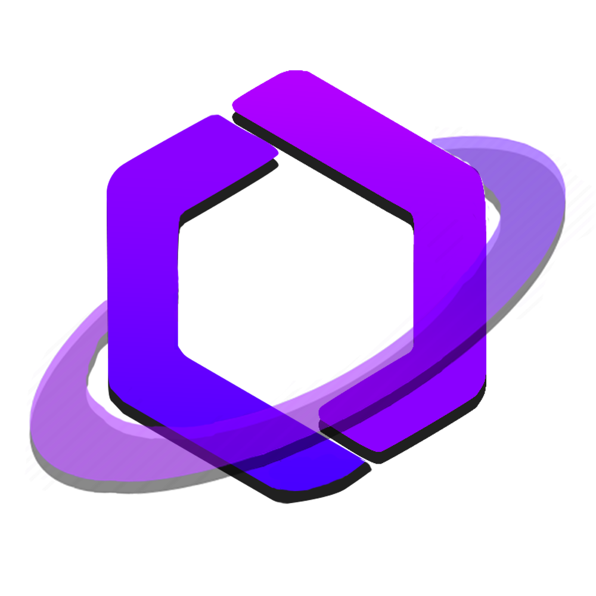

<p align="center"></p>

<h1 align="center">ModRealms Launcher</h1>

<em><h5 align="center"><a href="https://github.com/dscalzi/HeliosLauncher">Modified from HeliosLauncher</a></h5></em>

<!-- [<p align="center">](https://travis-ci.org/dscalzi/HeliosLauncher) [](https://github.com/dscalzi/HeliosLauncher/releases) </p> -->

<p align="center">Join ModRealms' servers easily and keep up to date with our packs and fixes!</p>

## Downloads

You can download from [GitHub Releases](https://github.com/ModRealms-Network/ModRealmsLauncher/releases)

## Development (ModRealms fork)

All ModRealms-specific changes (UI, assets, default configuration, etc...) will be in the master branch.

A development branch __mr-features__ will be used to work on new additions to the core mechanics of the original project (as below) and will keep up to date with the original project. We may submit features from this branch as a PR to the original project.


#### Latest Release
Coming Soon!
<!-- [](https://github.com/dscalzi/HeliosLauncher/releases/latest) -->

**Supported Platforms**

If you download from the [Releases](https://github.com/ModRealms-Network/HeliosLauncher/releases) tab, select the installer for your system.

| Platform | File |
| -------- | ---- |
| Windows x64 | `Helios-Launcher-setup-VERSION.exe` |
| macOS x64 | `Helios-Launcher-setup-VERSION.dmg` |
| macOS arm64 | `Helios-Launcher-setup-VERSION-arm64.dmg` |
| Linux x64 | `Helios-Launcher-setup-VERSION.AppImage` |

## Console

To open the console, use the following keybind.

```console
ctrl + shift + i
```

Ensure that you have the console tab selected. Do not paste anything into the console unless you are 100% sure of what it will do. Pasting the wrong thing can expose sensitive information.

#### Export Output to a File

If you want to export the console output, simply right click anywhere on the console and click **Save as..**


## Help

For help regarding this version (ModRealms' fork), contact the staff on the discord server below:

[][discord]


## Original Authors

This project is forked from HeliosLauncher, a project by dscalzi for the server WesterosCraft. Please visit and support their project at the links below!

* [Project Link][original]
* [Original Project Wiki][wiki]
* [Aventium Softworks Discord][discord2]

[discord]: https://discord.gg/tKKeTdc 'ModRealms Discord'
[discord2]: https://discord.gg/zNWUXdt 'Original Project Discord'
[original]: https://github.com/dscalzi/HeliosLauncher 'Original Project GitHub'
```console
> git clone https://github.com/ModRealms-Network/ModRealmsLauncher.git
> cd ModRealmsLauncher
> npm install
```

---

**Launch Application**

```console
> npm start
```

---

**Build Installers**

To build for your current platform.

```console
> npm run dist
```

Build for a specific platform.

| Platform    | Command              |
| ----------- | -------------------- |
| Windows x64 | `npm run dist:win`   |
| macOS       | `npm run dist:mac`   |
| Linux x64   | `npm run dist:linux` |

Builds for macOS may not work on Windows/Linux and vice-versa.

---

### Visual Studio Code

All development of the launcher should be done using [Visual Studio Code][vscode].

Paste the following into `.vscode/launch.json`

```JSON
{
  "version": "0.2.0",
  "configurations": [
    {
      "name": "Debug Main Process",
      "type": "node",
      "request": "launch",
      "cwd": "${workspaceFolder}",
      "program": "${workspaceFolder}/node_modules/electron/cli.js",
      "args" : ["."],
      "outputCapture": "std"
    },
    {
      "name": "Debug Renderer Process",
      "type": "chrome",
      "request": "launch",
      "runtimeExecutable": "${workspaceFolder}/node_modules/.bin/electron",
      "windows": {
        "runtimeExecutable": "${workspaceFolder}/node_modules/.bin/electron.cmd"
      },
      "runtimeArgs": [
        "${workspaceFolder}/.",
        "--remote-debugging-port=9222"
      ],
      "webRoot": "${workspaceFolder}"
    }
  ]
}
```

This adds two debug configurations.

#### Debug Main Process

This allows you to debug Electron's [main process][mainprocess]. You can debug scripts in the [renderer process][rendererprocess] by opening the DevTools Window.

#### Debug Renderer Process

This allows you to debug Electron's [renderer process][rendererprocess]. This requires you to install the [Debugger for Chrome][chromedebugger] extension.

Note that you **cannot** open the DevTools window while using this debug configuration. Chromium only allows one debugger, opening another will crash the program.

---

### Note on Third-Party Usage

Please give credit to the original author and provide a link to the original source. This is free software, please do at least this much.

---

### See you ingame.


[nodejs]: https://nodejs.org/en/ 'Node.js'
[vscode]: https://code.visualstudio.com/ 'Visual Studio Code'
[mainprocess]: https://electronjs.org/docs/tutorial/application-architecture#main-and-renderer-processes 'Main Process'
[rendererprocess]: https://electronjs.org/docs/tutorial/application-architecture#main-and-renderer-processes 'Renderer Process'
[chromedebugger]: https://marketplace.visualstudio.com/items?itemName=msjsdiag.debugger-for-chrome 'Debugger for Chrome'
[discord]: https://discord.gg/zNWUXdt 'Discord'
[wiki]: https://github.com/dscalzi/HeliosLauncher/wiki 'wiki'
